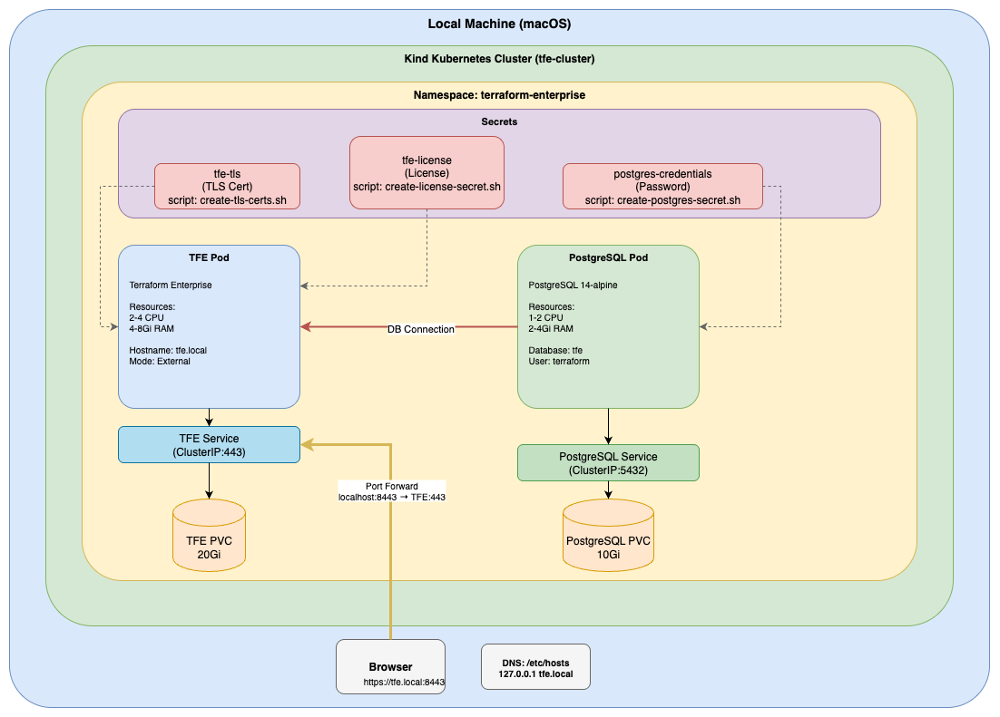
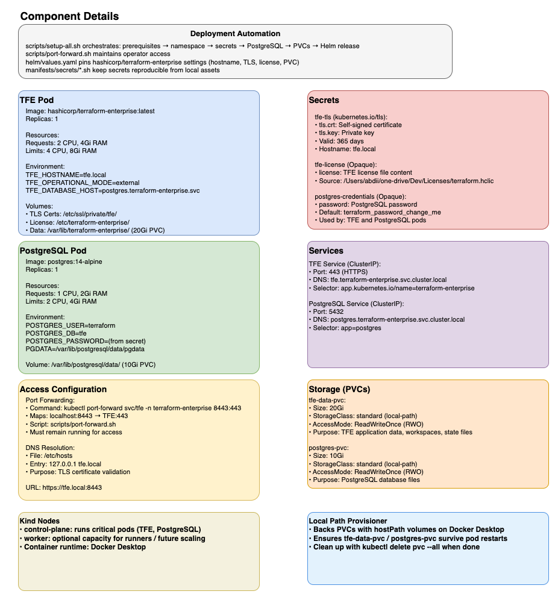

# Terraform Enterprise on Kind Kubernetes Cluster

Complete deployment guide for running HashiCorp Terraform Enterprise (TFE) on a local Kind Kubernetes cluster.

## Table of Contents
- [Overview](#overview)
- [Prerequisites](#prerequisites)
- [Architecture](#architecture)
- [Quick Start](#quick-start)
- [Detailed Installation Steps](#detailed-installation-steps)
- [Accessing TFE](#accessing-tfe)
- [Configuration](#configuration)
- [Troubleshooting](#troubleshooting)
- [Maintenance](#maintenance)
- [Cleanup](#cleanup)

## Overview

This repository provides a production-ready deployment of Terraform Enterprise on a local Kind Kubernetes cluster using Helm charts. The deployment includes:

- **Terraform Enterprise** (latest GA version)
- **PostgreSQL Database** (in-cluster deployment)
- **Persistent Storage** (local-path provisioner)
- **Self-signed TLS Certificates**
- **Port-forwarding access** (no ingress controller required)

**Note:** This setup is optimized for local development and sandbox environments. It uses `tfe.localtest.me` as the hostname, which resolves to `127.0.0.1` via public DNS — no `/etc/hosts` changes required.

## Prerequisites

### Required Tools
- [Docker Desktop](https://www.docker.com/products/docker-desktop/) (running)
- [Kind](https://kind.sigs.k8s.io/docs/user/quick-start/) v0.20.0+
- [kubectl](https://kubernetes.io/docs/tasks/tools/) v1.27.0+
- [Helm](https://helm.sh/docs/intro/install/) v3.12.0+
- OpenSSL (for certificate generation)

### System Requirements
- **CPU:** 8+ cores recommended
- **Memory:** 16GB+ RAM recommended
- **Disk Space:** 50GB+ free space

### TFE License
- Valid Terraform Enterprise license file: `/Users/abdii/one-drive/Dev/Licenses/terraform.hclic`

### Verify Prerequisites
```bash
# Check Docker
docker --version

# Check Kind
kind version

# Check kubectl
kubectl version --client

# Check Helm
helm version

# Check OpenSSL
openssl version
```

## Architecture

### Overview Diagrams

| Diagram | Preview | Highlights |
| --- | --- | --- |
| **Overview** |  | Shows how TFE, PostgreSQL, secrets, PVCs, and the access path fit inside the Kind namespace on your local macOS host. |
| **Components** |  | Breaks the stack into layers (automation scripts, services, pods, storage) and calls out which manifest or script owns each resource. |
| **Data Flow** |  | Focuses on runtime traffic: browser ↔ port-forward ↔ TFE service, TFE ↔ PostgreSQL, and pods ↔ PVCs backed by the local-path provisioner. |

### Components

1. **Terraform Enterprise (TFE)**
   - Latest production GA version
   - Runs as a StatefulSet/Deployment
   - Exposes HTTPS on port 443 (ClusterIP Service)
   - Uses self-signed TLS certificates
   - Hostname: `tfe.localtest.me`

2. **PostgreSQL Database**
   - Version: 14 (compatible with TFE)
   - Runs as a StatefulSet
   - Persistent storage: 10Gi
   - Internal service: `postgres.terraform-enterprise.svc.cluster.local`

3. **Storage**
   - Uses Kind's default local-path provisioner
   - TFE data: 20Gi PersistentVolumeClaim
   - PostgreSQL data: 10Gi PersistentVolumeClaim

## Quick Start

```bash
# 1. Clone this repository
git clone https://github.com/linuxus/tfe-kind.git
cd tfe-kind

# 2. Create Kind cluster (if not already created)
kind create cluster --name tfe-cluster --config kind-ha-cluster.yaml 

# 3. Create namespace
kubectl apply -f manifests/namespace.yaml

# 4. Create PostgreSQL credentials secret
./manifests/secrets/create-postgres-secret.sh

# 5. Create Redis credentials secret
./manifests/secrets/create-redis-secret.sh

# 6. Create TLS certificates
./manifests/secrets/create-tls-certs.sh

# 7. Create license secret
./manifests/secrets/create-license-secret.sh

# 8. Deploy PostgreSQL
kubectl apply -f manifests/postgres-pvc.yaml
kubectl apply -f manifests/postgres-deployment.yaml
kubectl apply -f manifests/postgres-service.yaml

# Wait for PostgreSQL to be ready
kubectl wait --for=condition=ready pod -l app=postgres -n terraform-enterprise --timeout=300s

# 9. Deploy Redis
kubectl apply -f manifests/redis-pvc.yaml
kubectl apply -f manifests/redis-statefulset.yaml
kubectl apply -f manifests/redis-service.yaml

# Wait for Redis to be ready
kubectl wait --for=condition=ready pod -l app=redis -n terraform-enterprise --timeout=300s

# 10. Create TFE Data PersistentVolumeClaim
kubectl apply -f manifests/tfe-pvc.yaml

# 11. Add HashiCorp Helm Repository
helm repo add hashicorp https://helm.releases.hashicorp.com
helm repo update

# 12. Deploy TFE using Helm
helm install tfe hashicorp/terraform-enterprise \
  -n terraform-enterprise \
  -f helm/values.yaml \
  --wait \
  --timeout 15m

# 13. Create TFE Environment Secrets (workaround for Helm chart bug)
# The Helm chart has a bug with secretKeyRefs, so we create this secret manually
kubectl create secret generic terraform-enterprise-env-secrets -n terraform-enterprise \
  --from-literal=TFE_LICENSE="$(kubectl get secret tfe-license -n terraform-enterprise -o jsonpath='{.data.license}' | base64 -d)" \
  --from-literal=TFE_REDIS_PASSWORD="$(kubectl get secret redis-credentials -n terraform-enterprise -o jsonpath='{.data.password}' | base64 -d)" \
  --from-literal=TFE_REDIS_SIDEKIQ_PASSWORD="$(kubectl get secret redis-credentials -n terraform-enterprise -o jsonpath='{.data.password}' | base64 -d)"

# 14. Restart TFE pod to pick up the secret
kubectl delete pod -n terraform-enterprise -l app=terraform-enterprise

# 15. Wait for TFE to be ready (5-10 minutes)
kubectl wait --for=condition=ready pod -l app=terraform-enterprise -n terraform-enterprise --timeout=600s

# 16. Start port forwarding
./scripts/port-forward.sh

# 17. Access TFE
open https://tfe.localtest.me:8443
```

## Detailed Installation Steps

### Step 1: Create Kind Cluster

If you don't have a Kind cluster running, create one:

```bash
kind create cluster --name tfe-cluster --config - <<EOF
kind: Cluster
apiVersion: kind.x-k8s.io/v1alpha4
nodes:
- role: control-plane
  extraPortMappings:
  - containerPort: 30443
    hostPort: 8443
    protocol: TCP
EOF
```

Verify the cluster:
```bash
kubectl cluster-info --context kind-tfe-cluster
kubectl get nodes
```

### Step 2: Create Namespace

```bash
kubectl apply -f manifests/namespace.yaml
```

Verify:
```bash
kubectl get namespace terraform-enterprise
```

### Step 3: Create PostgreSQL Credentials Secret

```bash
chmod +x manifests/secrets/create-postgres-secret.sh
./manifests/secrets/create-postgres-secret.sh
```

This script creates/updates the `postgres-credentials` secret that the StatefulSet needs to boot. Update the password in the script for anything beyond local dev.

Verify:
```bash
kubectl get secret postgres-credentials -n terraform-enterprise
```

### Step 4: Create Redis Credentials Secret

```bash
chmod +x manifests/secrets/create-redis-secret.sh
./manifests/secrets/create-redis-secret.sh
```

This script provisions the `redis-credentials` secret that both Redis and Terraform Enterprise need for authentication. Override the `REDIS_PASSWORD` env var before running for non-dev use.

Verify:
```bash
kubectl get secret redis-credentials -n terraform-enterprise
```

### Step 5: Generate TLS Certificates

Create self-signed TLS certificates for `tfe.localtest.me`:

```bash
chmod +x manifests/secrets/create-tls-certs.sh
./manifests/secrets/create-tls-certs.sh
```

This creates a Kubernetes TLS secret named `tfe-tls` in the `terraform-enterprise` namespace.

Verify:
```bash
kubectl get secret tfe-tls -n terraform-enterprise
```

### Step 6: Create License Secret

```bash
chmod +x manifests/secrets/create-license-secret.sh
./manifests/secrets/create-license-secret.sh
```

This reads your license file from `/Users/abdii/one-drive/Dev/Licenses/terraform.hclic` and creates a Kubernetes secret.

Verify:
```bash
kubectl get secret tfe-license -n terraform-enterprise
```

### Step 7: Deploy PostgreSQL

```bash
# Create PersistentVolumeClaim
kubectl apply -f manifests/postgres-pvc.yaml

# Deploy PostgreSQL
kubectl apply -f manifests/postgres-deployment.yaml
kubectl apply -f manifests/postgres-service.yaml

# Wait for PostgreSQL to be ready
kubectl wait --for=condition=ready pod -l app=postgres -n terraform-enterprise --timeout=300s
```

Verify PostgreSQL is running:
```bash
kubectl get pods -n terraform-enterprise -l app=postgres
kubectl logs -n terraform-enterprise -l app=postgres
```

Test PostgreSQL connection:
```bash
kubectl exec -it -n terraform-enterprise \
  $(kubectl get pod -n terraform-enterprise -l app=postgres -o jsonpath='{.items[0].metadata.name}') \
  -- psql -U terraform -d tfe -c '\l'
```

### Step 8: Deploy Redis

```bash
# Create PersistentVolumeClaim
kubectl apply -f manifests/redis-pvc.yaml

# Deploy Redis
kubectl apply -f manifests/redis-statefulset.yaml
kubectl apply -f manifests/redis-service.yaml

# Wait for Redis to be ready
kubectl wait --for=condition=ready pod -l app=redis -n terraform-enterprise --timeout=300s
```

Verify Redis is running:
```bash
kubectl get pods -n terraform-enterprise -l app=redis
kubectl logs -n terraform-enterprise -l app=redis
```

Basic connectivity test:
```bash
REDIS_POD=$(kubectl get pod -n terraform-enterprise -l app=redis -o jsonpath='{.items[0].metadata.name}')
kubectl exec -n terraform-enterprise $REDIS_POD -- \
  sh -c 'redis-cli -a "$REDIS_PASSWORD" ping'
```

### Step 9: Create TFE Data PersistentVolumeClaim

**Important:** This step is required but was missing from the original documentation.

```bash
kubectl apply -f manifests/tfe-pvc.yaml
```

Verify:
```bash
kubectl get pvc -n terraform-enterprise
```

### Step 10: Add HashiCorp Helm Repository

```bash
helm repo add hashicorp https://helm.releases.hashicorp.com
helm repo update
```

Verify:
```bash
helm search repo hashicorp/terraform-enterprise
```

### Step 11: Deploy TFE with Helm

```bash
helm install tfe hashicorp/terraform-enterprise \
  -n terraform-enterprise \
  -f helm/values.yaml \
  --wait \
  --timeout 15m
```

Monitor the deployment:
```bash
# Watch pods
kubectl get pods -n terraform-enterprise -w

# Check TFE logs
kubectl logs -n terraform-enterprise -l app=terraform-enterprise -f

# Check all resources
kubectl get all -n terraform-enterprise
```

**Note:** The initial deployment will fail due to a Helm chart bug with `secretKeyRefs`. This is expected and will be fixed in the next step.

### Step 12: Create TFE Environment Secrets

**Important:** Due to a bug in the HashiCorp Terraform Enterprise Helm chart (v1.6.5), the `secretKeyRefs` configuration doesn't work correctly. The chart creates an empty `terraform-enterprise-env-secrets` secret, which causes TFE to fail startup checks for missing license and Redis credentials.

As a workaround, we manually create the secret with the required environment variables:

```bash
kubectl create secret generic terraform-enterprise-env-secrets -n terraform-enterprise \
  --from-literal=TFE_LICENSE="$(kubectl get secret tfe-license -n terraform-enterprise -o jsonpath='{.data.license}' | base64 -d)" \
  --from-literal=TFE_REDIS_PASSWORD="$(kubectl get secret redis-credentials -n terraform-enterprise -o jsonpath='{.data.password}' | base64 -d)" \
  --from-literal=TFE_REDIS_SIDEKIQ_PASSWORD="$(kubectl get secret redis-credentials -n terraform-enterprise -o jsonpath='{.data.password}' | base64 -d)"
```

Verify the secret has the required data:
```bash
kubectl describe secret terraform-enterprise-env-secrets -n terraform-enterprise
# Should show: Data section with 3 entries
```

### Step 13: Restart TFE Pod

Restart the TFE pod so it picks up the newly created secret:

```bash
kubectl delete pod -n terraform-enterprise -l app=terraform-enterprise
```

Wait for the new pod to be created and start:
```bash
kubectl get pods -n terraform-enterprise -w
```

### Step 14: Wait for TFE to Be Ready

TFE takes 5-10 minutes to fully initialize all services. Wait for the pod to become ready:

```bash
kubectl wait --for=condition=ready pod -l app=terraform-enterprise -n terraform-enterprise --timeout=600s
```

You can monitor the startup progress by watching the logs:
```bash
kubectl logs -f -n terraform-enterprise -l app=terraform-enterprise
```

### Step 15: Set Up Port Forwarding

Start port forwarding to access TFE:

```bash
chmod +x scripts/port-forward.sh
./scripts/port-forward.sh
```

This forwards `localhost:8443` → `tfe-service:443` in the cluster.

**Note:** Keep this terminal window open. The port-forwarding will stop if you close it.

## Accessing TFE

### Initial Setup

1. Open your browser and navigate to: **https://tfe.localtest.me:8443**

2. You'll see a certificate warning (expected with self-signed certs):
   - **Chrome/Edge:** Click "Advanced" → "Proceed to tfe.localtest.me (unsafe)"
   - **Firefox:** Click "Advanced" → "Accept the Risk and Continue"
   - **Safari:** Click "Show Details" → "visit this website"

3. Complete the initial TFE setup wizard:
   - Create admin account
   - Configure organization settings
   - Set up first workspace

### Default Admin Account

Create your admin account during first-time setup. You'll be prompted to:
- Set admin username
- Set admin email
- Set admin password

### Subsequent Access

```bash
# Start port forwarding (if not running)
./scripts/port-forward.sh

# Access TFE
open https://tfe.localtest.me:8443
```

## Configuration

### Helm Values Customization

The main configuration is in `helm/values.yaml`. Key settings:

```yaml
# TFE Application Settings
tfe:
  hostname: "tfe.localtest.me"
  
# Database Configuration
database:
  host: "postgres.terraform-enterprise.svc.cluster.local"
  port: 5432
  
# Resource Limits
resources:
  requests:
    cpu: "2"
    memory: "4Gi"
  limits:
    cpu: "4"
    memory: "8Gi"
```

To update configuration:
```bash
# Edit values
vim helm/values.yaml

# Upgrade deployment
helm upgrade tfe hashicorp/terraform-enterprise \
  -n terraform-enterprise \
  -f helm/values.yaml
```

### PostgreSQL Configuration

PostgreSQL settings are in `manifests/postgres-deployment.yaml`:

```yaml
# Database credentials
POSTGRES_USER: terraform
POSTGRES_PASSWORD: terraform_password  # Change in production!
POSTGRES_DB: tfe
```

### Storage Configuration

To increase storage:

```yaml
# manifests/tfe-pvc.yaml
resources:
  requests:
    storage: 50Gi  # Increase from 20Gi

# manifests/postgres-pvc.yaml
resources:
  requests:
    storage: 20Gi  # Increase from 10Gi
```

**Note:** Changes to PVC size require deleting and recreating the PVC (data will be lost).

## Troubleshooting

### Helm Chart Bug: Empty terraform-enterprise-env-secrets Secret

**Symptom:** TFE pod crashes immediately after deployment with errors like:
```
[ERROR] terraform-enterprise: check failed: name=license err="error reading license value: no license detected"
[ERROR] terraform-enterprise: check failed: name=redis err="NOAUTH Authentication required"
```

**Cause:** HashiCorp Terraform Enterprise Helm chart v1.6.5 has a bug where the `env.secretKeyRefs` configuration (when specified as an object/map in `values.yaml`) doesn't properly populate the `terraform-enterprise-env-secrets` secret. The Helm template renders environment variable entries with empty `name:` fields, causing Kubernetes to reject the deployment.

**Solution:**
1. Check if the secret is empty:
```bash
kubectl describe secret terraform-enterprise-env-secrets -n terraform-enterprise
# If "Data" section shows 0 or is empty, the secret is affected
```

2. Delete the empty secret and recreate it manually:
```bash
kubectl delete secret terraform-enterprise-env-secrets -n terraform-enterprise

kubectl create secret generic terraform-enterprise-env-secrets -n terraform-enterprise \
  --from-literal=TFE_LICENSE="$(kubectl get secret tfe-license -n terraform-enterprise -o jsonpath='{.data.license}' | base64 -d)" \
  --from-literal=TFE_REDIS_PASSWORD="$(kubectl get secret redis-credentials -n terraform-enterprise -o jsonpath='{.data.password}' | base64 -d)" \
  --from-literal=TFE_REDIS_SIDEKIQ_PASSWORD="$(kubectl get secret redis-credentials -n terraform-enterprise -o jsonpath='{.data.password}' | base64 -d)"
```

3. Restart the TFE pod:
```bash
kubectl delete pod -n terraform-enterprise -l app=terraform-enterprise
```

4. Verify the secret has data:
```bash
kubectl describe secret terraform-enterprise-env-secrets -n terraform-enterprise
# Should show "Data" section with 3 entries
```

**Note:** This workaround is required for Helm chart version 1.6.5. Future versions may fix this bug.

### TFE Pod Not Starting

```bash
# Check pod status
kubectl get pods -n terraform-enterprise

# Describe pod for events
kubectl describe pod -n terraform-enterprise -l app=terraform-enterprise

# Check logs
kubectl logs -n terraform-enterprise -l app=terraform-enterprise --tail=100
```

Common issues:
- **Missing env-secrets:** See "Helm Chart Bug" section above
- **License error:** Verify license secret is created correctly
- **Database connection:** Ensure PostgreSQL is running and accessible
- **Missing TFE PVC:** Ensure `tfe-data-pvc` was created before Helm install
- **Resource constraints:** Check if Kind cluster has enough resources

### PostgreSQL Connection Issues

```bash
# Check PostgreSQL pod
kubectl get pod -n terraform-enterprise -l app=postgres

# Check PostgreSQL logs
kubectl logs -n terraform-enterprise -l app=postgres

# Test connection from TFE pod
kubectl exec -it -n terraform-enterprise \
  $(kubectl get pod -n terraform-enterprise -l app.kubernetes.io/name=terraform-enterprise -o jsonpath='{.items[0].metadata.name}') \
  -- nc -zv postgres.terraform-enterprise.svc.cluster.local 5432
```

### Certificate Errors

If you need to regenerate certificates:

```bash
# Delete existing secret
kubectl delete secret tfe-tls -n terraform-enterprise

# Regenerate
./manifests/secrets/create-tls-certs.sh

# Restart TFE
kubectl rollout restart statefulset/tfe -n terraform-enterprise
```

### Port Forwarding Issues

```bash
# Check if port is already in use
lsof -i :8443

# Kill existing port-forward
pkill -f "kubectl port-forward"

# Restart port-forward
./scripts/port-forward.sh
```

### Viewing All Logs

```bash
# TFE logs
kubectl logs -n terraform-enterprise -l app.kubernetes.io/name=terraform-enterprise -f

# PostgreSQL logs
kubectl logs -n terraform-enterprise -l app=postgres -f

# All events in namespace
kubectl get events -n terraform-enterprise --sort-by='.lastTimestamp'
```

### Checking Resource Usage

```bash
# Pod resource usage
kubectl top pods -n terraform-enterprise

# Node resource usage
kubectl top nodes

# Describe node
kubectl describe node tfe-cluster-control-plane
```

## Maintenance

### Viewing TFE Version

```bash
kubectl exec -n terraform-enterprise \
  $(kubectl get pod -n terraform-enterprise -l app.kubernetes.io/name=terraform-enterprise -o jsonpath='{.items[0].metadata.name}') \
  -- cat /etc/terraform-enterprise/version
```

### Upgrading TFE

```bash
# Update Helm repo
helm repo update

# Check available versions
helm search repo hashicorp/terraform-enterprise --versions

# Upgrade to specific version
helm upgrade tfe hashicorp/terraform-enterprise \
  -n terraform-enterprise \
  -f helm/values.yaml \
  --version <VERSION> \
  --wait

# Or upgrade to latest
helm upgrade tfe hashicorp/terraform-enterprise \
  -n terraform-enterprise \
  -f helm/values.yaml \
  --wait
```

### Backup

#### Backup PostgreSQL Database

```bash
# Create backup
kubectl exec -n terraform-enterprise \
  $(kubectl get pod -n terraform-enterprise -l app=postgres -o jsonpath='{.items[0].metadata.name}') \
  -- pg_dump -U terraform tfe > tfe-backup-$(date +%Y%m%d).sql

# Verify backup
ls -lh tfe-backup-*.sql
```

#### Backup TFE Data

```bash
# Get TFE pod name
TFE_POD=$(kubectl get pod -n terraform-enterprise -l app.kubernetes.io/name=terraform-enterprise -o jsonpath='{.items[0].metadata.name}')

# Backup TFE data directory
kubectl exec -n terraform-enterprise $TFE_POD -- tar czf /tmp/tfe-data-backup.tar.gz /var/lib/terraform-enterprise

# Copy to local
kubectl cp terraform-enterprise/$TFE_POD:/tmp/tfe-data-backup.tar.gz ./tfe-data-backup-$(date +%Y%m%d).tar.gz
```

### Restore

#### Restore PostgreSQL Database

```bash
# Copy backup to pod
kubectl cp tfe-backup-20250108.sql \
  terraform-enterprise/$(kubectl get pod -n terraform-enterprise -l app=postgres -o jsonpath='{.items[0].metadata.name}'):/tmp/

# Restore
kubectl exec -n terraform-enterprise \
  $(kubectl get pod -n terraform-enterprise -l app=postgres -o jsonpath='{.items[0].metadata.name}') \
  -- psql -U terraform tfe < /tmp/tfe-backup-20250108.sql
```

### Restart TFE

```bash
# Restart TFE pods
kubectl rollout restart deployment/tfe -n terraform-enterprise

# Or delete pod (will be recreated)
kubectl delete pod -n terraform-enterprise -l app.kubernetes.io/name=terraform-enterprise
```

### Scaling

TFE in this configuration runs as a single instance. For development purposes, this is appropriate.

## Cleanup

### Remove TFE Deployment

```bash
# Uninstall Helm release
helm uninstall tfe -n terraform-enterprise

# Delete PostgreSQL
kubectl delete -f manifests/postgres-service.yaml
kubectl delete -f manifests/postgres-deployment.yaml
kubectl delete -f manifests/postgres-pvc.yaml

# Delete PVCs
kubectl delete pvc -n terraform-enterprise --all

# Delete secrets
kubectl delete secret tfe-license tfe-tls -n terraform-enterprise

# Delete namespace
kubectl delete namespace terraform-enterprise
```

### Remove Kind Cluster

```bash
# Delete cluster
kind delete cluster --name tfe-cluster

```

## Additional Resources

- [Terraform Enterprise Documentation](https://developer.hashicorp.com/terraform/enterprise)
- [TFE Helm Chart](https://github.com/hashicorp/terraform-helm)
- [Kind Documentation](https://kind.sigs.k8s.io/)
- [Kubernetes Documentation](https://kubernetes.io/docs/)

## Support

For issues specific to this deployment:
- Check the [Troubleshooting](#troubleshooting) section
- Review logs using commands in this guide
- Open an issue in this repository

For TFE-specific issues:
- [HashiCorp Support](https://support.hashicorp.com/)
- [TFE Community Forum](https://discuss.hashicorp.com/c/terraform-enterprise/)

---

**Version:** 1.0.0  
**Last Updated:** November 8, 2025  
**Maintainer:** linuxus
